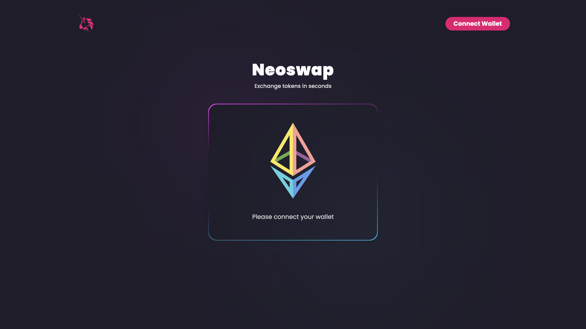

# [Neoswap V2](https://neoswap-v2.netlify.app/)

Welcome to Neoswap V2 – a cutting-edge decentralized exchange (DEX), building on the legacy of Uniswap V2. We've re-engineered the core contracts and frontend, offering an enhanced and secure trading experience for the DeFi community. Our focus is on providing a robust, user-friendly platform that aligns with the latest advances in Ethereum and smart contract development.

## Getting Started

To interact with Neoswap V2, you will need an Ethereum wallet like MetaMask and some ETH to pay for transaction fees. You can trade, add liquidity, or participate as a liquidity provider to earn fees.

### Key Components

Factory Contract

-   **Address:** 0x0b7fA5BBd782Ab50Ae3D25dC2b5a64d8909A73dc
-   The Factory contract is the cornerstone of Neoswap V2, responsible for creating new liquidity pools (pairs) and maintaining a registry of all active pools.

### How to Use Neoswap V2

1. **Connect Your Wallet**: Use a web3 wallet like MetaMask to interact with Neoswap V2.

2. **Trading**: Swap between different ERC-20 tokens with ease and security.

3. **Liquidity Provision:** Provide liquidity to pools and earn trading fees in return.

    - **FRWB Token / KACT Token Pair Contract (Sepolia):** 0xF76248643f58d8EC245971E26D3616A3ec9fB2ad
    - **FRWB Token / WETH Token Pair Contract (Sepolia):** 0x96076cD8BEfA3177390e78839e0bbf488Fa2D5BC
    - **KACT Token / WETH Token Pair Contract (Sepolia):** 0x66bf2aD0Dd688C58242D22075749AFbE2EA7F58c
    - **SHIBA INU FAKE Token / WETH Token Pair Contract (Sepolia):** 0xD59B2F33f5FbB7561A206b93180B72130d01CC76
    - **SHIBA INU FAKE Token / KACT Token Pair Contract (Sepolia):** 0x9E914340C01751BA761f9412f08d1C17c3d44320
    - **SHIBA INU FAKE Token / FRWB Token Pair Contract (Sepolia):** 0x72099BB338aFbdDE5d21AC16113DAe3B6eDEabeb

4. **Pool Creation:** Create new trading pairs if they don’t exist already, directly through the Factory contract.

## Key Features

### Modernized Smart Contracts

-   **Solidity 0.8.23:** Our smart contracts have been updated to Solidity version 0.8.23, a significant upgrade from the antiquated Solidity versions used in original Uniswap contracts. This update incorporates the latest security features and optimizations in Solidity, ensuring a more secure and efficient trading environment.

### Advanced Testing with Foundry

-   **Comprehensive Test Suite:** Neoswap V2 boasts a thorough Foundry test suite, including unit tests, fuzz tests, and invariant tests. This exhaustive testing ensures that our contracts are robust, secure, and function as intended under various conditions.

### For Developers

Developers interested in building on or integrating with Neoswap V2 can find our codebase and detailed documentation on GitHub. The smart contract code, including tests, is open-source and available for review and contributions.

### Security and Audits

The security of our platform and users' funds is our top priority. Neoswap V2's contracts have undergone rigorous internal testing. We strongly believe in transparency and the resilience of decentralized security practices.

**_Disclaimer: Neoswap V2 is a decentralized platform. Please ensure you understand the risks associated with DeFi and smart contract interactions before using the platform._**

Welcome to the future of decentralized trading with Neoswap V2 – where innovation meets security and efficiency.
